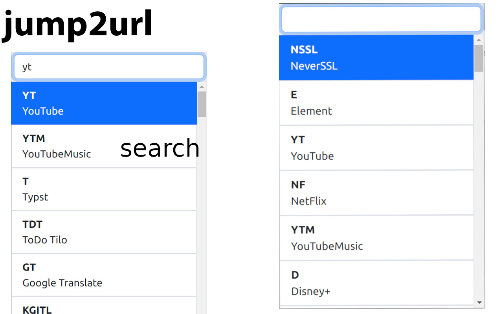

#  jump2url

This extension provides the ability to jump to a URL by searching for it in the bookmarks.

1. [Usage](#usage)
2. [jump2url](#jump2url)
3. [Navigation](#navigation)
4. [Searching](#searching)
5. [How to add a shortcut](#how-to-add-a-shortcut)
6. [Contribution](#contribution)

## Usage

This extension only consists of a popup.

You can configure a shortcut for this popup in the extensions page.

It defaults to `Ctrl+.`

If you want to close the popup you can press the escape key or anywhere outside of the popup window.

## jump2url

This is the main feature of this extension.

The extension jumps to the URL of the selected shortcut across all windows and tabs.

In case the URL is not found it will open a new tab with the URL.

If you are currently in a new tab, it will open the URL in the current tab, no matter if it is already open in another tab.

## Navigation

When you open the popup you will see a list of all shortcuts.

Any key press will focus the input field and start a search.  
Furthermore you can click on a shortcut to start the page.

You can navigate the list with the arrow keys.

You can start the selected page with the enter key.

## Searching

You can search for a shortcut by typing in the input field.

The search is a fuzzy search that matches against key, title and URL

## How to add a shortcut

All shortcuts are created from your bookmarks.

The Key is always all uppercase letters of the bookmark.

Only bookmarks with at least one uppercase letter are considered, the rest is ignored and not shown in the popup.

To make this a bit clearer, here is an example:

Bookmark title: `YouTube Music`

The key would be `YTM`

## Contribution

For contribution please make sure to use the following tools:

- [biome](https://biomejs.dev/) As your formatting tool and linter

Suggestions and pull requests are welcomed!
